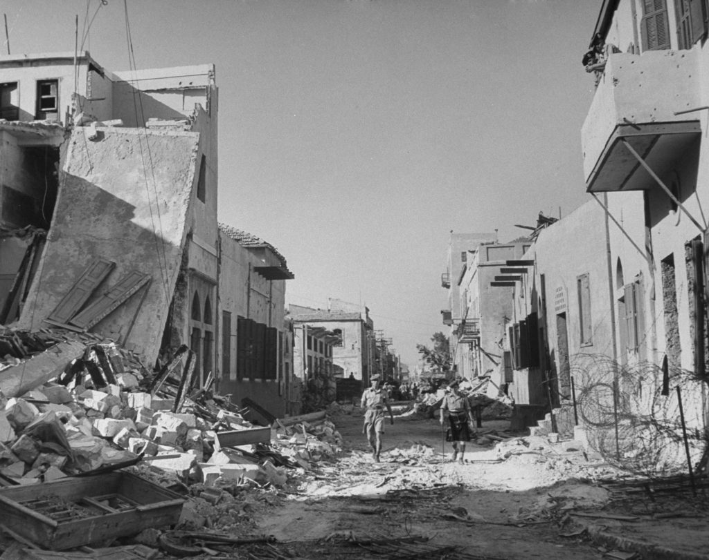

# Why is Peace Always Out of Reach? - A Century of Israeli-Palestinian Conflict

[](https://app.netlify.com/sites/roots-of-conflict/deploys)

This is an interactive timeline website aimed at exploring the major conflicts, attacks, peace processes, and key turning points between Palestine and Israel over the past century.

[](https://roots-of-conflict.netlify.app/)

---

## About This Project

This project presents key historical events from the 1920s to the present day through a visual timeline. Users can:

- Browse major conflicts and peace accords from different historical periods.
- Understand the trends of rocket attacks from the Gaza Strip through an interactive chart.
- Switch between dark/light themes and Chinese/English interfaces.
- Quickly filter and highlight specific types of events using a Floating Action Button (FAB).

## Tech Stack


## Features

- **Bilingual Support**: Toggle between Traditional Chinese and English at any time.
- **Dark/Light Theme**: Choose between dark or light reading modes based on your preference.
- **Responsive Design**: A great viewing experience on both desktop and mobile devices.
- **Interactive Timeline**: Explore events through scrolling and clicking.
- **Event Filtering & Highlighting**: Use the floating button in the bottom-right corner to quickly focus on specific event types (e.g., Peace Process, Pivotal Moments).
- **Dynamic Data Loading**: All timeline data is sourced from a single JSON object, making it easy to update and maintain.

## Prerequisites

Please make sure you have [Node.js](https://nodejs.org/) (which includes npm) installed on your system.

## Local Development

To run this project on your local machine, please follow these steps:

1.  **Clone the repository**

    ```bash
    git clone https://github.com/Timeline-Chronicler/roots-of-conflict.git
    ```

2.  **Navigate to the project directory**

    ```bash
    cd roots-of-conflict
    ```

3.  **Install dependencies**

    ```bash
    npm install
    ```

4.  **Start the development mode (watch for file changes)**

    ```bash
    npm run dev
    ```

    This command starts an automated watch service that monitors your source files. When you modify and save a file (like `index.html` or anything in `src/`), the necessary output files in the `dist/` folder will be automatically recompiled.

5.  **Open the `index.html` file in the project's root directory with your browser**
    - **Tip**: It's recommended to use the "Live Server" extension in VS Code for an auto-refreshing browser preview.

## Deployment

This project can be automatically deployed on any modern hosting service (like Netlify, Vercel, etc.) that integrates with GitHub.

The required build settings are:

- **Build Command:** `npm run build`
- **Publish Directory:** `dist`

Any push to the `main` branch will typically trigger a new deployment on the configured hosting service.

---

## License

This project is released into the **public domain** under [The Unlicense](https://unlicense.org/).
